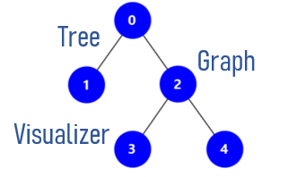
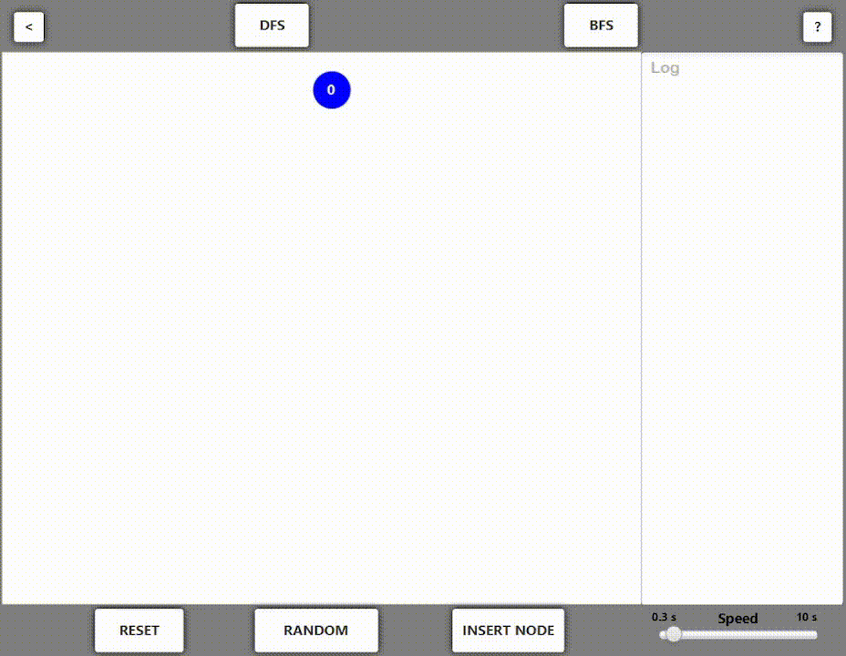
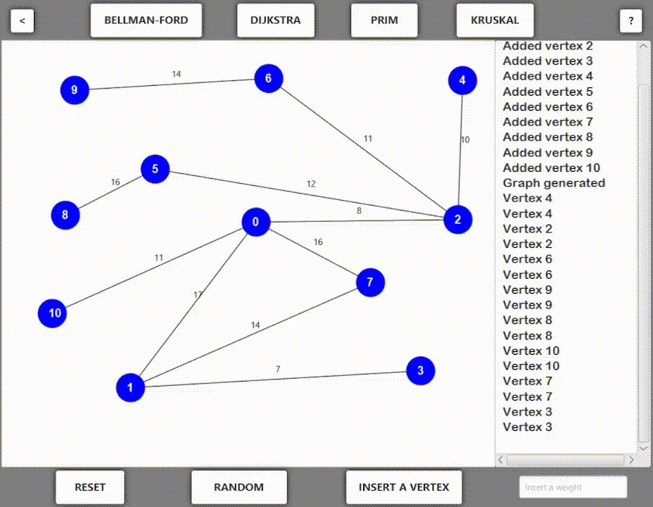
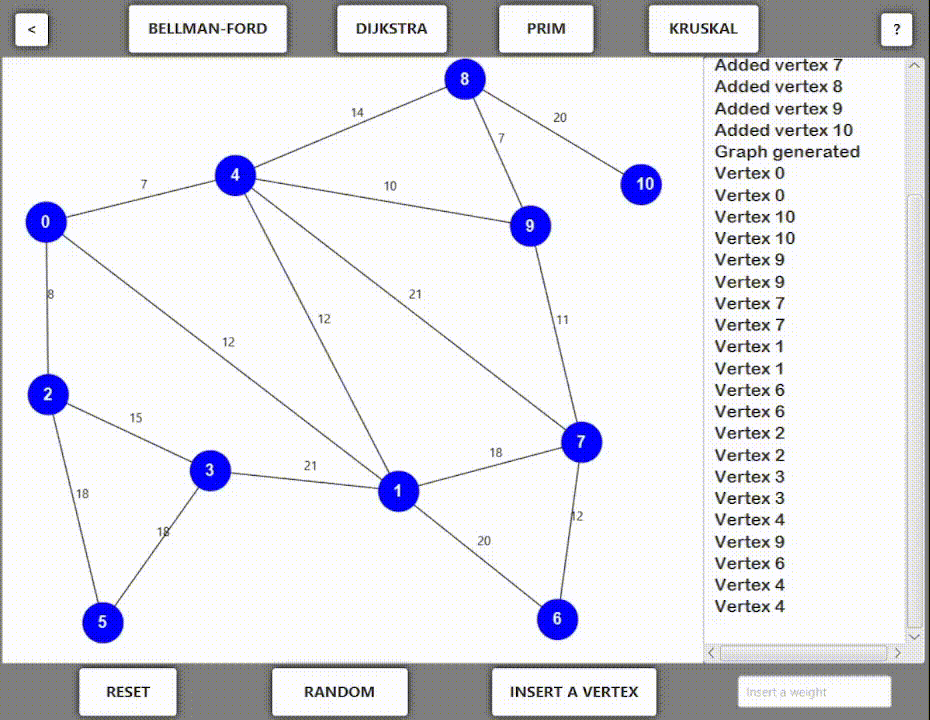
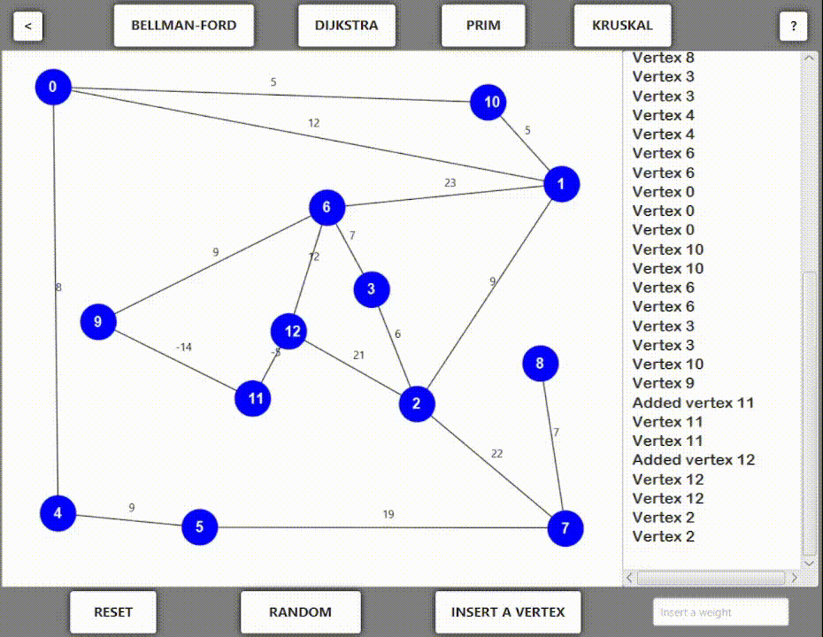

  

<h1 align="center">
Tree and graph visualizer in Java
</h1>

The Tree & Graph visualizer is a tool designed to visualize and analyze trees and graphs intuitively and effectively. This application offers an interface that allows users to load, create, and manipulate tree and graph data structures, as well as apply a range of fundamental algorithms for their analysis.

The application provides various algorithms for structure analysis:

- **Breadth-First Search (BFS)** and Depth-First Search (DFS) for Trees: Users can select a root node and initiate the BFS or DFS algorithm. The app will display the order in which nodes are visited, highlighting the path taken by the algorithm.

- **Bellman-Ford**: This algorithm can be applied to graphs to calculate shortest paths from starting nodes to all other nodes, considering edges with negative weights as well.

- **Prim**: For undirected and weighted graphs, the Prim's algorithm helps find a Minimum Spanning Tree that connects all nodes with the minimum total weight.

- **Kruskal**: This algorithm also works on undirected and weighted graphs, but employs a different approach to find a Minimum Spanning Tree by selecting edges with the minimum weight.

- **Dijkstra**: This algorithm computes shortest paths from a starting node to all other nodes in a non-negative weighted graph.

Algorithms can be executed through buttons in the application interface, and the results will be displayed clearly, both within the graphical representation of the tree or graph and through textual information.

- ### In [this](https://www.youtube.com/watch?v=jy3XS51Yajg) video you can watch a demo

## Features: Tree
1. Insert a node in the tree

2. **Delete a node in the tree**

3. **Depth first search** 

4. **Breadth first search**

## Features: Graph

1. **Insert a vertex**

2. **Bellman Ford algorithm**

3. **Dijkstra algorithm**

4. **Prim algorithm**

5. **Kruskal algorithm**

